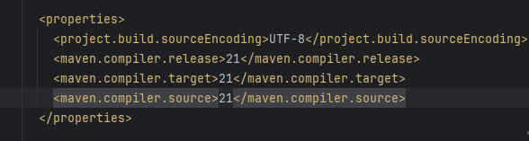
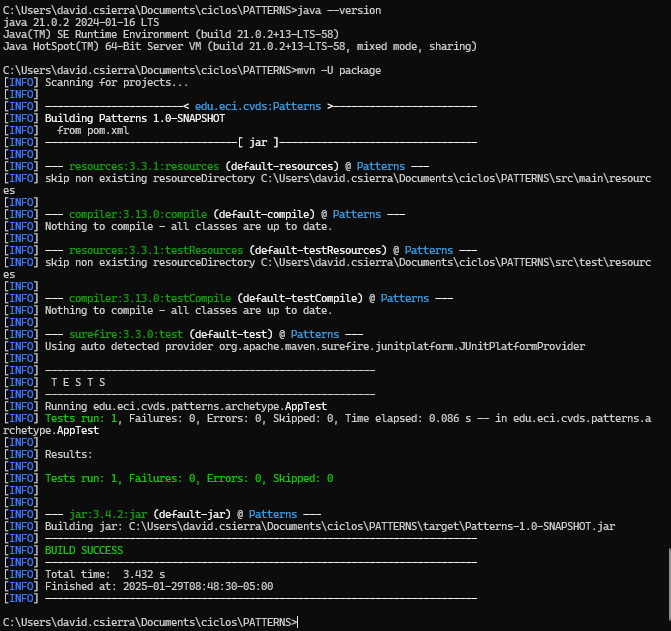
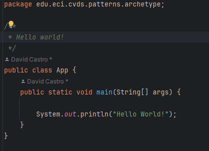
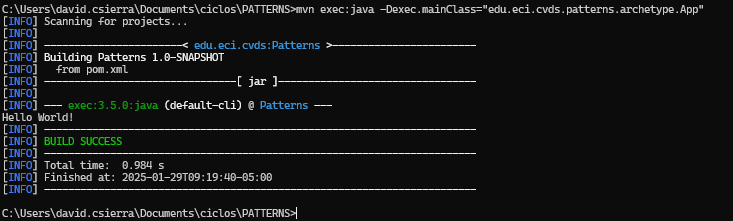

# PATTERNS
## INTEGRANTES

**David Santiago Castro Sierra**

**Juan Esteban Cely Lopez**


### EJERCICIO DE LAS FIGURAS

### CREAR UN PROYECTO CON MAVEN
En este caso se creo un proyecto maven con ayuda de los arquetipos (archetypes).

Se usaron estos parametros para la estructura del proyecto de maven:
```yml
ProjectId: org.apache.maven.archetypes:maven-archetype-quickstart:1.0
Id del Grupo: edu.eci.cvds
Id del Artefacto: Patterns
Paquete: edu.eci.cvds.patterns.archetype
```

Se   creo en el directorio, un nuevo proyecto `Patterns` a partir de un modelo o arquetipo, que crea un conjunto de directorios con un conjunto de archivos básicos.

Pasos para saber si la estructura de proyecto maven esta bien:

Cambie al directorio `Patterns`:
```sh
$ cd Patterns
```

Para ver el conjunto de archivos y directorios creados por el comando `mvn` ejecute el comando `tree`.
```sh
$ tree
```
En caso de que no funcione en git bash, otra herramienta que se puede usar es PowerShell ya que ésta maneja el comando "tree".

En algunos sistemas operativos, este comando no funciona correctamente o puede requerir un parámetro (por ejemplo: `tree /f`). En caso que funcione, la
salida muestra la estructura del proyecto, similar a como se muestra a continuación:
```sh
.
│ pom.xml
└───src
├───main
│ └───java
│ └───edu
│ └───eci
│ └───cvds
│ └───patterns
  └───archetype
│ App.java
│
└───test
└───java
└───edu
└───eci
└───cvds
└───patterns
└───archetype
AppTest.java
```

Edite el archivo `pom.xml` y realize la siguiente actualización:

Hay que cambiar la version del compilador de Java a la versión 8, para ello, agregue la sección `properties` antes de la sección de
dependencias:
```xml
<properties>
  <maven.compiler.target>1.8</maven.compiler.target>
  <maven.compiler.source>1.8</maven.compiler.source>
</properties>
```

## COMPILAR Y EJECUTAR
Para compilar ejecute el comando:
```sh
$ mvn package
```

Si maven no actualiza las dependencias utilice la opción `-U` así:
```sh
$ mvn -U package
```


**Pom.xml**


**Eejecución**



**-Busque cuál es el objetivo del parámetro "package" y qué otros parámetros se podrían enviar al comando `mvn`.**


El parámetro `package` en el comando `mvn` se utiliza para compilar el código fuente del proyecto y empaquetarlo en su formato distribuible, como un archivo JAR o WAR. Este comando es parte del ciclo de vida de Maven y se encarga de preparar el proyecto para su distribución.

Además del parámetro `package`, hay otros parámetros que se pueden enviar al comando `mvn`:

1. **clean**: Limpia el directorio de destino eliminando todos los archivos generados por compilaciones anteriores.
2. **compile**: Compila el código fuente del proyecto.
3. **test**: Ejecuta las pruebas unitarias utilizando un marco de pruebas adecuado.
4. **install**: Instala el paquete en el repositorio local, para que otros proyectos puedan depender de él.
5. **deploy**: Copia el paquete final al repositorio remoto para compartirlo con otros desarrolladores y proyectos.


**Busque cómo ejecutar desde línea de comandos, un proyecto maven y verifique la salida cuando se ejecuta con la clase `App.java` como parámetro en "mainClass".**
   
   
    `mvn exec:java -Dexec.mainClass=""`


**Realice el cambio en la clase `App.java` para crear un saludo personalizado, basado en los parámetros de entrada a la aplicación.**




**Utilizar la primera posición del parámetro que llega al método "main" para realizar elsaludo personalizado, en caso que no sea posible, se debe mantener el saludo como se encuentra actualmente:**


**Buscar cómo enviar parámetros al plugin "exec".**

`mvn exec:java -Dexec.mainClass="com.ejemplo.App" -Dexec.args="parametro`

**Ejecutar nuevamente la clase desde línea de comandos y verificar la salida: Hello World!**





